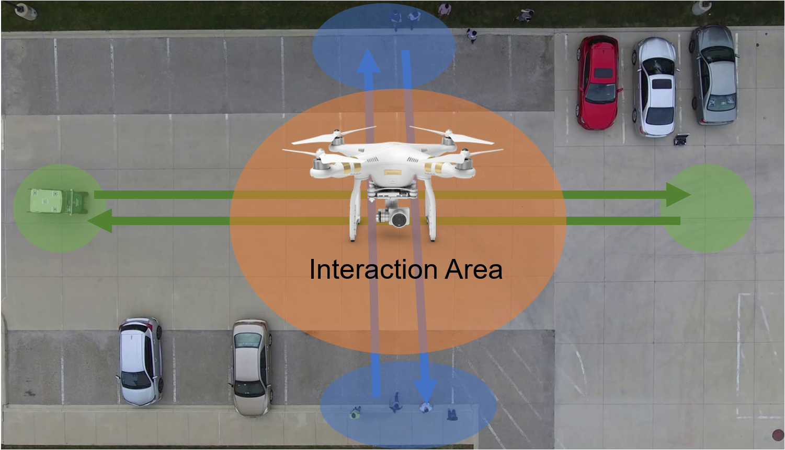
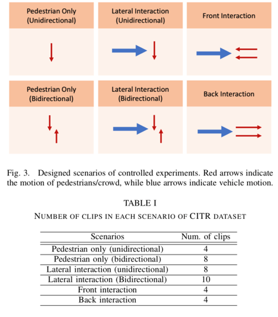
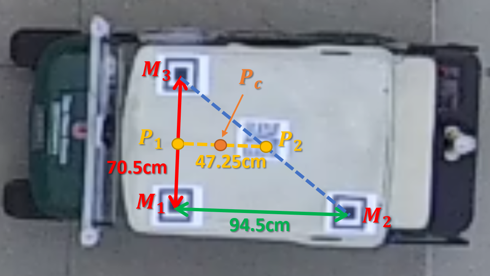
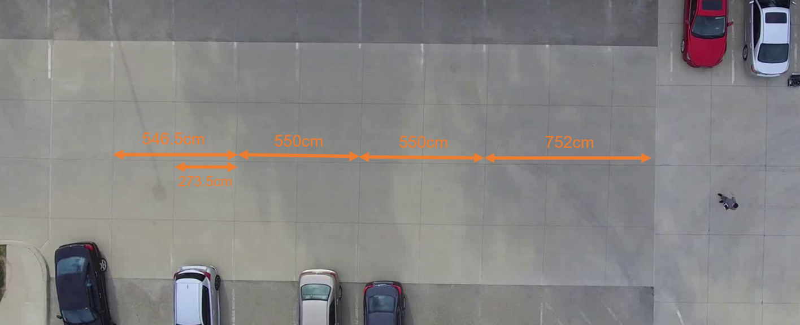

# Vehicle-Crowd Intraction (VCI) - CITR Dataset
Top-view trajectory data of pedestrians in groups under vehicle influence in controlled experiments

* Last updated on 04/19/2019
* E-mail: yang.3455@osu.edu


* Control and Intelligent Transportation Research (CITR) Lab
* Department of Electrical and Computer Engineering
* Center for Automotive Research (CAR)

## Note

**A major update was done on Apr 19, 2019. An extended Kalman filter was applied for refining the vehicle trajectory, so that the output vehicle state contains (x, y, heading, speed), which is in accordance with a vehicle model (bicycle model).**

A sister dataset of pedestrian trajectories, DUT dataset, which consists of everyday scenarios in university campus, can be accessed at [here](https://github.com/dongfang-steven-yang/vci-dataset-dut).

The detailed description of both datasets can be accessed at arXiv preprint: [Top-view Trajectories: A Pedestrian Dataset of Vehicle-Crowd Interaction from Controlled Experiments and Crowded Campus](https://arxiv.org/abs/1902.00487).

This paper was accepted to [The 30th IEEE Intelligent Vehicles Symposium in Paris](http://iv2019.org/). 

If you find the dataset useful, please consider citing the above paper. :grinning:

## Overview

The CITR dataset was collected in the controlled experiments that were conducted in a parking lot near the facility of Control and Intelligent Transportation Research (CITR) Lab at The Ohio State University (OSU). The controlled experiments consist of a series of fundamental vehicle-crowd interactions in the hope of analyzing interactive pedestrian motion under the vehicle influence. A DJI Phamton 3 SE Drone with a down-facing camera on a gimbal system was used as the recording equipment. Participants are members of CITR Lab at OSU. During the experiments, they were instructed to walk from one small area (starting points) to another small area (destinations). The employed vehicle was an EZ-GO Golf Cart mannualy driven by a participant. 3 markers were put on top of the vehicle to help vehicle motion tracking, of which the vehicle center position is calculated by geometry. 

Below is a figure showing the configuration of the controlled experiment area (a parking lot near CITR Lab at OSU). The vehicle (a golf cart) moves back and forth between two blue areas. Pedestrians move back and forth between two green areas. The interaction happens in the orange area, which is also the central area of the recording.



A video clip with both the pedestrains and the vehicle labeled is shown below:

<video width="700" height="400" controls>
  <source src="/demo-citr.mp4" type="video/mp4">
  Your browser does not support the video tag.
</video>

<!--
[](https://www.youtube.com/watch?v=_s4qQgscuDw "CITR Dataset Demo")
-->

## Download Stabilized Raw Videos
The stabilized raw videos of CITR dataset can be downloaded at following links:
- [Google Drive Download](https://drive.google.com/open?id=1WSnLO0njzOReQmqAcSWwnvthVydd7BCu).
- [Baidu Yun Download](https://pan.baidu.com/s/1HYc_VEBn95BYD2yufWxcNw). Code: h5kj


## Experiment

### Scenarios: 

There 6 diffrerent sceanrios in the controlled experiments desigend for the purpose of detailed camparison and analysis. They are shown below:



### Statistics
- 340 pedestrian trajectoreis in total
- 38 video clips, with each clip of about 20 seconds

## Description of The CITR Repository

### Dataset in `\data`
Inside this folder, there are raw `\trajectories` and `\trajectories_filtered`. The above 6 secnearios are grouped by folers.

#### Filtered Trajectories
We recommend you to use data in `\trajectories_filtered`. 

`.txt` is the ratio/scale file that converts between pixel coordinates (1920x1080) and coordinates in meters. All the recorded trajectories have already been converted in meters. If you want to convert back to pixels for visulization, you can simply multiply the numerical value in this file.

`.pdf` is a plot giving you an overview of the trajectories (colored is raw, and black is filtered).

There are two `.csv` files, one for all pedestrians, one for all vehicles. Below is the header descriptio

For pedestrian `.csv`: 
```
id: pedestrian id
frame: frame number of the video clip
label: 'ped' means pedestrian
x_est: estiamted x position
y_est: estimated y position
xv_est: estiamted velocity in x axis
yv_est: estimated velocity in y axis
```

For vehicle `.csv`: 
```
id: vehicle id
frame: frame number of the video clip
label: 'veh' means vehicle
x_est: estiamted x position
y_est: estimated y position
psi_est: orientation (heading angle) of the vehicle (in rad)
vel_est: longitudinal velocity of the vehicle
```

#### Raw Trajectories
If you would like to use raw `\trajectories`, be careful that they are stored in a different format:

Each `.csv` file corresponds to only 1 object, with the ID on the file name, for example, `p3.csv` means pedestrian with ID 3, `v1.csv` means vehicle with ID 1.

For pedestrian `.csv`: 
```
frame: frame number of the video clip
id: pedestrian id
x: tracked x position
y: tracked y position
```

For vehicle `.csv`: 
```
frame: frame number from the video clip
id: vehicle id
x_c: x position of P_c
y_c: y position of P_c
x_1: x position of P_1
y_1: y position of P_1
x_2: x position of P_2
y_2: y position of P_2
```

For the definition of `P_1, P_2, P_c`, see the following picture:


Below is a rough measure of the vehicle shape. If you need precision, you can measure it yourself by using the above figure. 
```
                   right side                             
                       |
                      0.6m
                       |
front bumper -- 1m -- P_c -- 1.2m -- rear bumper
                       |
                      0.6m
                       |
                   left side 
```

Again, there is a `.txt` ratio/scale file that converts between pixel coordinates (1920x1080) and coordinates in meters


## Filters and Tools

The data has already been filtered, so you don't have to do it again. We just provide them for your refernce. 

These are python codes for filtering the raw data `filter_trajectories.py` and generating statistics `statistics.py`. The Kalman filters were implemented in `tools\kalman_filters.py`.


<!--
## From Meters to Pixels
All trajectoires have already been converted from pixels in frames into meters. To recover trajectories in pixels, you can use the ratio of pixels to meters stored in "ratio_pixel2meter.txt" (if the scenario contains vehicle) or "ratio_pixel2meter_ground.txt" (if the scenario only contains pedestrians).



-->

## Errors
- If you find any errors, please contact the author.

