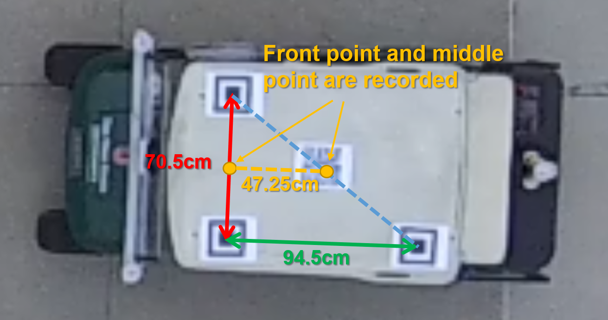

# Vehicle-Crowd Intraction (VCI) - CITR Dataset
Pedestrians and Vehicle Trajectories for Vehicle-Crowd Interaction in Controlled Experiment

* Last updated on 01/18/2019
* E-mail: yang.3455@osu.edu

The Ohio State Unviversity

Control and Intelligent Transportation Research (CITR) Lab

Department of Electrical and Computer Engineering

Center for Automotive Research (CAR)

## Overview

The controlled experiments were conducted in a parking lot near the facility of Control and Intelligent Transportation Research (CITR) Lab at The Ohio State University (OSU). A DJI Phamton 3 SE Drone with a down-facing camera with on a gimbal system was used as the recording equipment. Participants are members of CITR Lab at OSU. During the experiments, they were instructed only to walk from one small area (starting points) to another small area (destinations). The employed vehicle was an EZ-GO Golf Cart. 3 markers were put on top of the vehicle to help vehicle motion tracking, of which the vehicle position is calculated by geometry. 

[](https://www.youtube.com/watch?v=_s4qQgscuDw "CITR Dataset Demo")

Another pedestrian trajectory dataset, DUT dataset, is also available at [here](https://github.com/dongfang-steven-yang/vci-dataset-dut).


## Experiment

### Scenarios: 

Pedestrian only scenarios:
- 4 x Unidirectional Pedestrian Crossing
- 8 x Bidirectional Pedestrian Crossing (4 x 5v5, 4 x 3v7)
Lateral interaction scenarios:
- 8 x Unidirectional Crossing with Vehicle Interaction (4 x normal driving, 4 x yeilding)
- 10 x Bidirectional Crossing with Vehicle Interaction
Front/back interaction scenarios:
- 4 x Vehicle-Crowd Front Interaction
- 4 x Veihcle-Crowd Back Interaction

### Statistics
- 400 pedestrian trajectoreis in total
- 38 video clips, with each clip of about 20 seconds

## Dataset Description

### Folders
- The folder is named as the name of a particular sceanrio. It contains the trajectories of all pedestrians and vehicles.

### Figures
- You may refer to "result_peds.svg" and "result_vehs.svg" for the details of Kalman filtering result.

### Pedestrians
- Inside a particular sceanrio, the trajectory of each pedestrian is stored in "p*.csv" file. Here "*" stands for the serial number of the pedestrian. Note among all scenarios, a pedestrian with the same serial number indifies the same pedestrian.
- In the ".csv" file, the first row is the header. In each of the following rows, entries from left to right represnet:

```
frame: frame number from the video clip
x_measure: tracked x position in pixels (unfiltered)
y_measure: tracked y position in pixels (unfiltered)
x_est: x position estimated by Kalman filter
y_est: y position estimated by Kalman filter
vx_est: x velocity estimated by Kalman filter 
vy_est: y velocity estimated by Kalman filter
```

- You may need to truncate the trajectory if necessary, especially if you are using the estimated velocity. Since we don't have direct measurement for velocities, if a pedestrian stops moving, the estimated velocity out of Kalman filter becomes less accurate. Please check the figures for detailed filtering result.

### Vehicles
- Inside a particular sceanrio, the trajectory of each vehicle is stored in "v*.csv" file. Here "*" stands for the serial number of the vehicle. Since usually there is only one vehicle, you will only see "v1.csv". If there is no vehicle in the scenario, you won't see any file starting with "v".
- The vehicle is tracked by two markers on the vehicle top in the video: center marker and front marker. To obtain the vehicle trajectory, the middle point between these two markers is calculated. *The vehicle shape can be estimated based on the middle point by following measaure:*
[maybe delete this part, becasue each experiment might have different values]

```
                         ight side                             
                             |
                            0.6m
                             |
front bumper -- 1.2m -- middle point -- 1m -- rear bumper
                             |
                            0.6m
                             |
                         left side 
```

- In the ".csv" file, the first row is the header. In each of the following rows, entries from left to right represnet:

```
frame: frame number from the video clip
x_measure: tracked x position of the vehicle center marker in pixels (unfiltered)
y_measure: tracked y position of the vehicle center marker in pixels (unfiltered)
x_front_measure: tracked x position of the vehicle front marker in pixels (unfiltered)
y_front_measure: tracked y position of the vehicle front markerin pixels (unfiltered)
x_mid_measure: x position of the middle point between above center and front markers (unfiltered)
y_mid_measure: y position of the middle point between above center and front markers (unfiltered)
x_mid_est: x position of the middle point estimated by Kalman filter
y_mid_est: y position of the middle point estimated by Kalman filter
vx_mid_est: x velocity of the middle point estimated by Kalman filter 
vy_mid_est: y velocity of the middle point estimated by Kalman filter
```

- Note that for vehicle trajectory, only middle point is filtered. 

## From Meters to Pixels
All trajectoires have already been converted from pixels in frames into meters. To recover trajectories in pixels, you can use the ratio of pixels to meters stored in "ratio_pixel2meter.txt" (if the scenario contains vehicle) or "ratio_pixel2meter_ground.txt" (if the scenario only contains pedestrians).




## Errors
- If you find any errors, please contact the author.

